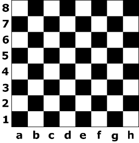

# guess_number

Here we go.



## Implementation details

You should implement the following procedure.
It will be called by the grader once for each test case.

```
int guess(int n)
```

* $n$: ...
* This procedure should return ...

## Examples

### Example 1

Consider $n=5$.

```
guess(5)
```

The answer is $0$ because...

## Constraints

* $1 \leq n \leq  1000$

## Subtasks

1. (20 points) $n \leq 100$,
1. (80 points) No additional constraints.

## Sample grader

The sample grader reads the input in the following format:
* line $1$:  $\;\;n$

The sample grader prints a single line containing the return value of `guess`.
