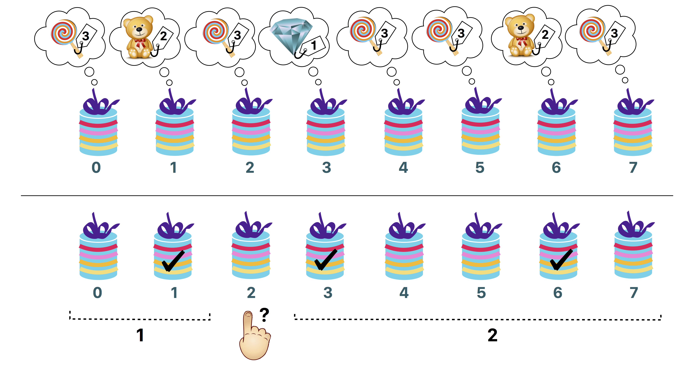

# The Big Prize

The Big Prize is a famous TV game show.
You are the lucky contestant who has advanced to the final round.
You are standing in front of a row of $n$ boxes, labeled $0$ through $n-1$ from left to right.
Each box contains a prize that cannot be seen until the box is opened.
There are $v \geq 2$ different *types* of prizes.
The types are numbered from $1$ to $v$ in *decreasing* order of value.

The prize of type $1$ is the most expensive one: a diamond.
There is exactly one diamond in the boxes.
The prize of type $v$ is the cheapest one: a lollipop.
To make the game more exciting, the number of cheaper prizes is much larger than the number of more expensive ones.
More specifically, for all $t$ such that $2 \leq t \leq v$ we know the following:
if there are $k$ prizes of type $t-1$, there are *strictly more* than $k^2$ prizes of type $t$.

Your goal is to win the diamond.
At the end of the game you will have to open a box and you will receive the prize it contains.
Before having to choose the box to open you get to ask Rambod, the host of the game show, some questions.
For each question, you choose some box $i$.
As his answer, Rambod will give you an array $a$ containing two integers.
Their meaning is as follows:
* Among the boxes to the left of box $i$ there are exactly $a[0]$ boxes that contain a more expensive prize than the one in box $i$.
* Among the boxes to the right of box $i$ there are exactly $a[1]$ boxes that contain a more expensive prize than the one in box $i$.

For instance, suppose that $n=8$. For your question, you choose the box $i=2$.
As his response, Rambod tells you that $a=[1,2]$.
The meaning of this response is:
* Exactly one of the boxes $0$ and $1$ contains a prize more expensive than the one in box $2$.
* Exactly two of the boxes $3, 4, \ldots, 7$ contain a prize more expensive than the one in box $2$.

Your task is to find the box containing the diamond by asking a small number of questions.

## Implementation details

You should implement the following procedure:

```
int find_best(int n)
```

* This procedure is called exactly once by the grader.
* $n$: the number of boxes.
* The procedure should return the label of the box which contains the diamond, i.e., the unique integer $d$ ($0 \leq d \leq n-1$) such that box $d$ contains a prize of type $1$.

The above procedure can make calls to the following procedure:

```
int[] ask(int i)
```

* $i$: label of the box that you choose to ask about. The value of $i$ must be between $0$ and $n-1$, inclusive.
* This procedure returns the array $a$ with $2$ elements. Here, $a[0]$ is the number of more expensive prizes in the boxes to the left of box $i$ and $a[1]$ is the number of more expensive prizes in the boxes to the right of box $i$.


## Example

The grader makes the following procedure call:

```
find_best(8)
```

There are $n=8$ boxes. Suppose the prize types are $[3,2,3,1,3,3,2,3]$.
All possible calls to the procedure `ask` and the corresponding return values are listed below.

- `ask(0)` returns $[0, 3]$
- `ask(1)` returns $[0, 1]$
- `ask(2)` returns $[1, 2]$
- `ask(3)` returns $[0, 0]$
- `ask(4)` returns $[2, 1]$
- `ask(5)` returns $[2, 1]$
- `ask(6)` returns $[1, 0]$
- `ask(7)` returns $[3, 0]$

In this example, the diamond is in box $3$. So the procedure `find_best` should return $3$.

 

The above figure illustrates this example.
The upper part shows the types of the prizes in each box.
The lower part illustrates the query `ask(2)`.
The marked boxes contain more expensive prizes than the one in box $2$.

## Constraints

* $3 \leq n \leq 200\,000$.
* The type of the prize in each box is between $1$ and $v$, inclusive.
* There is exactly one prize of type $1$.
* For all $2 \leq t \leq v$, if there are $k$ prizes of type $t-1$, there are *strictly* more than $k^2$ prizes of type $t$.

## Subtasks and scoring

In some test cases the behavior of the grader is adaptive.
This means that in these test cases the grader does not have a fixed sequence of prizes.
Instead, the answers given by the grader may depend on the questions asked by your solution.
It is guaranteed that the grader answers in such a way that after each answer there is at least one sequence of prizes consistent with all the answers given so far.

1. (20 points) There is exactly $1$ diamond and $n-1$ lollipops (hence, $v = 2$).
You can call the procedure `ask` at most $10\,000$ times.
1. (80 points) No additional constraints.

In subtask 2 you can obtain a partial score.
Let $q$ be the maximum number of calls to the procedure `ask` among all test cases in this subtask.
Then, your score for this subtask is calculated according to the following table:

Questions | Score
--- | ---
$10\,000 < q$ | $0$ (reported in CMS as 'Wrong Answer')
$6000 < q \leq 10\,000$ | $70$
$5000 < q \leq 6000$ | $80 - (q-5000)/100$
$q \leq 5000$ | $80$

## Sample grader

The sample grader is not adaptive.
Instead, it just reads and uses a fixed array $p$ of prize types. For all $0 \leq b \leq n-1$, the type of the prize in box $b$ is given as $p[b]$.
The sample grader expects input in the following format:

- line $1$: $n$
- line $2$: $p[0]$ $p[1]$  $\ldots$ $p[n-1]$

The sample grader prints a single line containing the return value of `find_best` and the number of calls to the procedure `ask`.